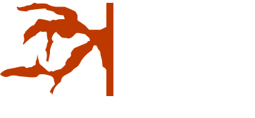

# Root Need Control
### Global Game Jam 2023 Daejeon

root need control은 바깥뿌리가 달린 괴생명체의 균형을 지키기 위해 \
괴생명체의 뿌리 길이의 균형을 지켜야하는 아케이드 게임입니다. 

2023년 2월 3일부터 2월 5일까지 진행된 <b>글로벌 게임잼 2023</b>에서 참여를 통해 개발을 시작하여, \
게임잼 주제인 <b>ROOTS</b> 를 기반으로 의도 및 제작되었습니다.

# Project Info
1. 프로그래밍 언어 : Lua (PICO-8 Based, .p8)
2. 게임엔진 : PICO-8 0.2.5C
3. 사용 통합 개발 환경 (IDE) : Visual Studio Code
4. 게임잼 : Global Game Jam 2023 
5. 지역 : 대전광역시 유성구, 대전글로벌게임센터 (S.Korea)

본 프로젝트는 게임잼 활동으로부터 제작되었습니다.\
소스코드는 공개용이지만 참고 및 응용은 권장하지 않습니다.

